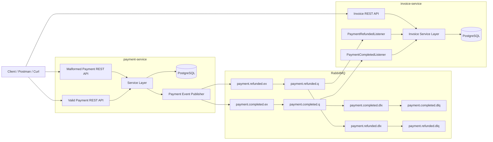

# RabbitMQ Retry and DLQ Sample

This repository demonstrates a practical **Event-Driven Architecture (EDA)** sample using **Spring Boot microservices**, **RabbitMQ**, **retry**, and **Dead Letter Queue (DLQ)** handling.

The project simulates a payment and invoice flow where one service publishes payment events and another service consumes them asynchronously.  
The main goal of the sample is to show how a system can behave when:

- a valid event is processed successfully
- a malformed event is retried and then sent to DLQ
- a malformed event is considered non-retryable and sent directly to DLQ
- an operator manually inspects the failed message from RabbitMQ UI, republishes a corrected version to the main queue, and then removes the original failed message from the DLQ to restore data consistency

---

## Overview

The system consists of two microservices:

- **payment-service**
  - exposes REST APIs for valid payment operations
  - exposes REST APIs for publishing intentionally malformed events
  - stores payment data in **PostgreSQL**
  - publishes payment events to RabbitMQ:
    - `PaymentCompletedEvent`
    - `PaymentRefundedEvent`

- **invoice-service**
  - exposes REST APIs for reading invoices
  - stores invoice data in **PostgreSQL**
  - consumes payment events from RabbitMQ:
	- `PaymentCompletedEvent`
	- `PaymentRefundedEvent`
  - applies retry behavior for selected failures
  - routes failed messages to **DLQ**

This setup demonstrates how microservices can remain loosely coupled while still handling real-world messaging problems such as retries, poison messages, and recovery from DLQ.

---

## Architecture Diagram


	
---

## Event Flows

### Normal Event Flow [Payment Completed]

1. The client sends a request to create a completed payment.
2. `payment-service` saves the payment in PostgreSQL.
3. `payment-service` publishes a `PaymentCompletedEvent` to RabbitMQ.
4. `invoice-service` consumes the event from `payment.completed.q`.
5. `invoice-service` processes the event and creates or updates an invoice with status `PAID`.
6. The invoice is persisted in PostgreSQL.
7. The client can retrieve the invoice via REST endpoints.

---

### Normal Event Flow [Payment Refunded]

1. The client sends a request to refund a payment.
2. `payment-service` saves the refund in PostgreSQL.
3. `payment-service` publishes a `PaymentRefundedEvent` to RabbitMQ.
4. `invoice-service` consumes the event from `payment.refunded.q`.
5. `invoice-service` updates the existing invoice and marks it as `REFUNDED`.
6. The updated invoice is persisted in PostgreSQL.
7. The client can retrieve the updated invoice via REST endpoints.

---

### Retryable Failure Flow

This flow demonstrates a **temporary or fixable failure** where retrying or correcting the message can lead to success.

#### Example:
Invalid currency value (e.g. `"ABC"` instead of `USD`, `EGP`, `EUR`).

1. A request triggers `payment-service` to publish an event with invalid data.
2. The event is successfully published to RabbitMQ.
3. `invoice-service` consumes the event from the main queue.
4. During processing, validation fails (e.g. invalid currency).
5. A **retryable exception** is thrown.
6. Spring Retry attempts reprocessing based on:
   - max attempts
   - backoff strategy
7. If all retry attempts fail:
   - the message is rejected
   - RabbitMQ routes it to the **DLQ** via DLX
8. The message is now stored in the DLQ for inspection.

---

### Non-Retryable Failure Flow

This flow demonstrates a failure where retrying will **not fix the problem**.

#### Example:
Refund event received before the invoice exists.

1. `payment-service` publishes a `PaymentRefundedEvent`.
2. `invoice-service` consumes the event.
3. The service attempts to locate the corresponding invoice.
4. The invoice does not exist.
5. A **non-retryable exception** is thrown.
6. No retries are attempted.
7. The message is immediately routed to the **DLQ**.
8. The message remains in the DLQ for investigation.

---

## Tech Stack

- Java 21
- Spring Boot 4
- Spring Data JPA
- RabbitMQ
- PostgreSQL
- Docker Compose
- JUnit 5
- Testcontainers
- MapStruct
- Lombok

---

## Project Structure

```text
rabbitmq-rety-dlq-sample/
├── docker-compose.yml
├── README.md
├── rabbitmq-rety-dlq-sample.postman_collection.json
├── docs/
│   └── images/
├── payment-service/
└── invoice-service/
```

---

## Running the Project

Make sure Docker Desktop is installed and running.

From the root folder of the project, run:

```bash
docker compose up -d --build
```

This will start:

- RabbitMQ
- PostgreSQL
- payment-service
- invoice-service

To stop the environment:

```bash
docker compose down
```

To stop and remove volumes:

```bash
docker compose down -v
```

---

## Service URLs

### payment-service

Base URL:

```text
http://localhost:8081
```

### invoice-service

Base URL:

```text
http://localhost:8082
```

### RabbitMQ Management UI

```text
http://localhost:15672
```

Default credentials:

```text
username: guest
password: guest
```

---

## API Endpoints

### Payment Service Endpoints

Create Payment [Valid]

```http
POST /api/v1/valid/payments
```

Refund Payment [Valid]

```http
POST /api/v1/valid/payments/{paymentId}/refund
```

Get All Payments

```http
GET /api/v1/valid/payments
```

Publish Payment Completed [Invalid]

```http
POST /api/v1/malformed/payments/payment-completed
```

Publish Payment Refunded [Invalid]

```http
POST /api/v1/malformed/payments/payment-refunded
```

### Invoice Service Endpoints

Get Invoice By Payment Id

```http
GET /api/v1/invoices/payment/{paymentId}
```

Get All Invoices

```http
GET /api/v1/invoices
```

---

## Curl Samples

### payment-service

#### Create Payment [Valid]

```bash
curl --location 'http://localhost:8081/api/v1/valid/payments' \
--header 'Content-Type: application/json' \
--data-raw '{
    "orderId": "30c64473-7940-4296-86d9-4653cfb17470",
    "customerEmail": "ss@ss.com",
    "amount": 275.5,
    "currency": "EGP"
}'
```

#### Refund Payment [Valid]

```bash
curl --location 'http://localhost:8081/api/v1/valid/payments/9c30f0fa-4de5-4623-99d9-75a277e0d187/refund' \
--header 'Content-Type: application/json' \
--data-raw '{
    "orderId": "04a81a68-1fbf-4f78-9f9f-c0d17acb5c05",
    "customerEmail": "mm@mm.com",
    "amount": 150.0,
    "currency": "EGP"
}'
```

#### Get All Payments

```bash
curl --location 'http://localhost:8081/api/v1/valid/payments'
```

#### Publish Payment Completed [Invalid]

```bash
curl --location --request POST 'http://localhost:8081/api/v1/malformed/payments/payment-completed'
```

#### Publish Payment Refunded [Invalid]

```bash
curl --location --request POST 'http://localhost:8081/api/v1/malformed/payments/payment-refunded'
```

### invoice-service

#### Get Invoice By Payment Id

```bash
curl --location 'http://localhost:8082/api/v1/invoices/payment/0d366890-8ce2-447a-a39b-afaff40c4f6f'
```

#### Get All Invoices

```bash
curl --location 'http://localhost:8082/api/v1/invoices'
```

---

## Postman Collection

A ready-to-use Postman collection is included in the repository:

```text
rabbitmq-rety-dlq-sample.postman_collection.json
```

You can import it directly into Postman and test the full flow.

---

## Testing

The project contains automated tests, including:

- unit tests for service layer logic
- unit tests for consumer delegation behavior
- integration tests for controller endpoints
- Testcontainers-based tests for database-backed integration scenarios

This helps validate the behavior in an environment closer to real infrastructure.

---

## Queue Monitoring and Manual Recovery

This sample is designed to be observed using **RabbitMQ Management UI** while executing requests.

You can access RabbitMQ UI at:
http://localhost:15672

Default credentials:
- username: guest
- password: guest

---

### What to Monitor

While sending requests, observe:

- Messages entering:
  - `payment.completed.q`
  - `payment.refunded.q`
- Retry attempts (visible in application logs)
- Messages moving to:
  - `payment.completed.dlq`
  - `payment.refunded.dlq`

This provides visibility into how the system behaves under normal and failure scenarios.

---

### Manual Recovery from DLQ

One of the most important aspects of this sample is demonstrating how to recover from failures using DLQ replay.

> Note: Messages in DLQ are not processed automatically.  
> Manual intervention is required to inspect, fix, and replay them.

---

#### Retryable Case (Fix + Replay)

**Example:** Invalid currency value

1. Open RabbitMQ Management UI.
2. Navigate to the DLQ (e.g. `payment.completed.dlq`).
3. Click on the queue and inspect the message.
4. Identify the issue (e.g. invalid `"currency": "ABC"`).
5. Copy the original payload and fix the invalid fields (e.g. `"currency": "USD"`).
6. Use the **"Publish message"** feature in RabbitMQ UI to send the corrected message to:
   - `payment.completed.q`
7. `invoice-service` consumes the message again.
8. Processing succeeds.
9. Invoice is saved in PostgreSQL.
10. **Data consistency is restored between services.**
11. After successful processing, remove the original failed message from the DLQ:
    - either by acknowledging it manually
    - or by purging the DLQ if appropriate

---

#### Non-Retryable Case (Investigation First)

**Example:** Refund event received before the invoice exists

1. Open the DLQ message from RabbitMQ UI.
2. Inspect the payload and identify the issue.
3. Investigate the root cause:
   - missing prior event?
   - ordering issue?
   - data inconsistency?
4. Fix the root problem:
   - ensure the invoice exists
   - restore correct system state
5. Optionally replay the message to the main queue:
   - `payment.refunded.q`
6. If conditions are now valid, processing will succeed.

---

### Screenshots

Relevant screenshots demonstrating DLQ monitoring and message replay are available in:

docs/images/

These include:
- RabbitMQ queues overview
- Example DLQ message
- Manual message replay using RabbitMQ UI
- DLQ cleanup (acknowledge / purge)

---

## Key Takeaways

- Not all failures are equal:
  - Retryable → temporary or fixable
  - Non-retryable → requires investigation
- DLQ is not a dead end — it is a **recovery mechanism**
- Manual replay is a powerful tool to:
  - fix bad messages
  - restore consistency
- Monitoring queues is essential in real production systems

This sample demonstrates not only event-driven communication,  
but also **real-world operational handling of failures in distributed systems**.

---

## Why This Project Matters

This project is not just a simple messaging demo.

It focuses on real-world challenges in distributed systems, such as:
- handling retryable vs non-retryable failures
- dealing with poison messages
- using Dead Letter Queues (DLQ) effectively
- performing manual recovery through message replay
- restoring data consistency between microservices

In production environments, these scenarios are common and critical.

This sample demonstrates how a system can remain resilient and recover from failures while maintaining eventual consistency.